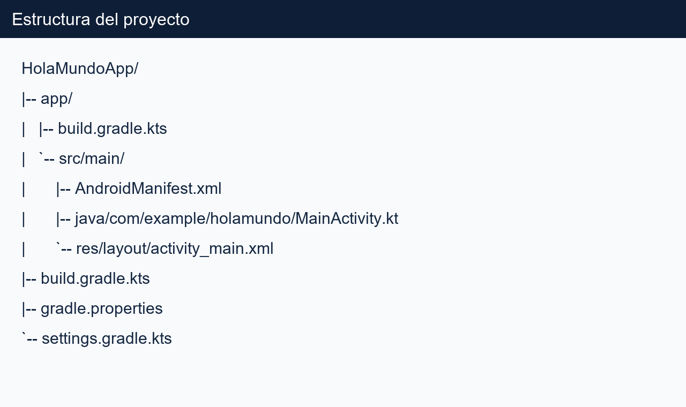
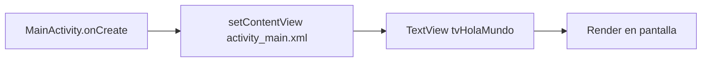

# HolaMundoApp

[](https://developer.android.com/)
[](https://kotlinlang.org/)
[](https://gradle.org/)
[](#licencia)

Aplicacion Android base para la actividad 2.2 del curso de Programacion Movil. El proyecto implementa una pantalla inicial con el mensaje **Hola Mundo**, y deja una estructura limpia para evolucionar a versiones mas completas.

Repositorio: **https://github.com/MarcelDeulofeuth19/hola-mundo-app**

## Tabla de contenido

- [Resumen ejecutivo](#resumen-ejecutivo)
- [Capturas](#capturas)
- [Arquitectura y stack](#arquitectura-y-stack)
- [Estructura del proyecto](#estructura-del-proyecto)
- [Requisitos](#requisitos)
- [Quick start](#quick-start)
- [Flujo de trabajo con Git y PR](#flujo-de-trabajo-con-git-y-pr)
- [Comandos utiles](#comandos-utiles)
- [Troubleshooting](#troubleshooting)
- [Roadmap](#roadmap)
- [Autor](#autor)
- [Licencia](#licencia)

## Resumen ejecutivo

Este repositorio demuestra tres competencias clave:

1. **Configuracion de entorno Android** con Android Studio + SDK.
2. **Construccion de una app funcional minima** usando Kotlin y XML.
3. **Versionamiento colaborativo** con Git y flujo de Pull Request en GitHub.

## Capturas


### Estructura de carpetas



## Arquitectura y stack

### Stack tecnico

- **IDE:** Android Studio
- **Lenguaje:** Kotlin
- **UI:** XML (ConstraintLayout + TextView)
- **Build system:** Gradle Kotlin DSL
- **Control de versiones:** Git + GitHub
- **SDK:** `compileSdk 34`, `targetSdk 34`, `minSdk 24`

### Flujo de inicializacion



## Estructura del proyecto

```text
HolaMundoApp/
|-- app/
|   |-- build.gradle.kts
|   |-- proguard-rules.pro
|   `-- src/main/
|       |-- AndroidManifest.xml
|       |-- java/com/example/holamundo/MainActivity.kt
|       `-- res/
|           |-- layout/activity_main.xml
|           `-- values/strings.xml
|-- build.gradle.kts
|-- gradle.properties
|-- settings.gradle.kts
`-- README.md
```

### Archivos principales

| Archivo | Responsabilidad |
|---|---|
| `MainActivity.kt` | Punto de entrada de UI. Ejecuta `setContentView` en `onCreate`. |
| `activity_main.xml` | Define layout principal y `TextView` centrado. |
| `strings.xml` | Centraliza textos de interfaz. |
| `AndroidManifest.xml` | Declara actividad launcher y configuracion global de app. |
| `app/build.gradle.kts` | Dependencias AndroidX, compilacion y parametros de build. |

## Requisitos

- Android Studio estable (recomendado: version reciente)
- JDK 17
- Android SDK instalado
- Emulador Android o dispositivo fisico con USB debugging
- Git instalado

## Quick start

### 1) Clonar

```bash
git clone https://github.com/MarcelDeulofeuth19/hola-mundo-app.git
cd hola-mundo-app
```

### 2) Abrir en Android Studio

- `File > Open` y seleccionar la carpeta del proyecto.
- Esperar sincronizacion de Gradle.

### 3) Ejecutar

- Seleccionar emulador/dispositivo.
- Presionar `Run`.

## Flujo de trabajo con Git y PR

### Ramas

- `main`: rama estable.
- `feature/*` o `chore/*`: cambios de desarrollo.

### Flujo recomendado

```bash
git checkout -b feature/nombre-cambio
# editar archivos
git add .
git commit -m "feat: descripcion breve del cambio"
git push -u origin feature/nombre-cambio
```

Crear Pull Request en GitHub hacia `main` con:

- **Titulo claro** (que problema resuelve)
- **Descripcion tecnica** (que cambia y por que)
- **Checklist** de pruebas ejecutadas

## Comandos utiles

```bash
# estado del repositorio
git status -sb

# historial compacto
git log --oneline --graph --decorate -10

# traer cambios remotos
git fetch --all --prune

# cambiar remoto
git remote -v
```

## Troubleshooting

### Error de Gradle sync

- Verificar internet y repositorios (`google`, `mavenCentral`).
- Confirmar versiones compatibles de plugin Android/Kotlin.

### Emulador no inicia

- Habilitar virtualizacion en BIOS.
- Revisar Device Manager y recrear AVD.

### Error de permisos GitHub

- Validar URL del remoto.
- Verificar autenticacion de Git (token/credenciales).

## Roadmap

- [ ] Migrar a arquitectura en capas (UI / domain / data)
- [ ] Agregar pruebas unitarias de primer nivel
- [ ] Configurar pipeline CI (build y lint)
- [ ] Incorporar navegacion entre pantallas

## Autor

- **Marcel Deulofeuth**
- **Correo:** mdeulofeuth@alocredit.co

## Licencia

Uso academico.
